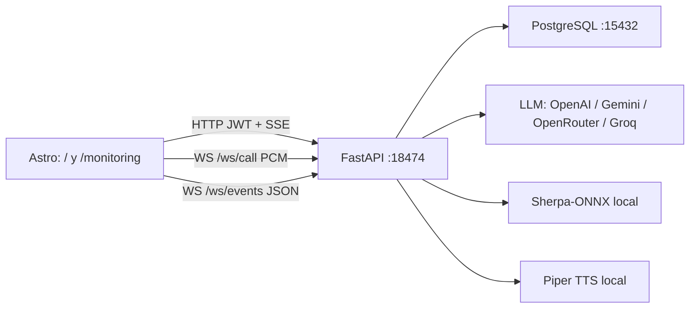

# Documentación

Índice del producto **Kognia Hacka**: plataforma pivotable (core + dominio de voz) para una hackatón de ~6 horas. El código actual es un agente de voz local con tenant, persistencia y monitor; la intención es reutilizar capacidades, no una telco rígida.

**Audiencia:** quien arranca la demo, quien cambia un contrato, o quien decide KEEP/ADAPT/DROP al conocer el reto.

**Autoridad:**

- Código y operaciones: verificado (tests, schemas, Compose).
- Producto y principios: aceptado por el equipo; no implica que ya esté implementado.

## Cómo usar este árbol

1. [Producto](product/README.md) — contexto, AP-01…AP-17, gap, telefonía, intelligence.
2. [Arquitectura](architecture/README.md) — actual vs objetivo.
3. [API](api/README.md) — HTTP, SSE y WebSockets.
4. [Datos](data/README.md) — PostgreSQL, Alembic, invariantes de tenant.
5. [Auth](auth/README.md) — JWT, roles, bootstrap.
6. [Backend](backend/README.md) — providers, agente, voz.
7. [Frontend](frontend/README.md) — páginas, llamada, monitoreo, UI.
8. [Operación](operations/README.md) — local, Docker, env, verificación.
9. [Referencia](reference/README.md) — scripts, tests, variables, puertos.

El README de raíz sigue siendo el arranque corto para `make setup`. Esta carpeta es la fuente detallada.

## Mapa rápido

| Pregunta | Documento |
| --- | --- |
| ¿Qué corre de punta a punta? | [Arquitectura → flujo feliz](architecture/overview.md) |
| ¿Qué endpoint uso? | [API HTTP](api/http.md) |
| ¿Cómo habla `/ws/call`? | [WebSockets](api/websockets.md) |
| ¿Dónde vive el historial? | [Esquema](data/schema.md) |
| ¿Cómo creo el SUPERADMIN? | [Auth](auth/README.md) |
| ¿Qué modelos LLM hay? | [Providers](backend/providers.md) |
| ¿Cómo arranco Docker? | [Compose](operations/docker.md) |
| ¿Cómo despliego y qué secrets necesito? | [Azure](operations/azure.md) |
| ¿Qué comprueba el smoke? | [Verificación](operations/verification.md) |
| ¿Cuál es la apuesta y cómo pivotar? | [Producto → contexto](product/context.md) |
| ¿Qué es core vs dominio? | [Capacidades](product/capabilities.md) |
| ¿Hacia dónde va Compose/worker/Chroma? | [Arquitectura objetivo](architecture/target.md) |

## Estado del producto

| Capacidad | Estado | Evidencia |
| --- | --- | --- |
| Health live/ready | Verificado | `backend/app/main.py`, `backend/tests/test_health.py` |
| Login JWT + SUPERADMIN/ADMIN | Verificado | `backend/app/auth/`, `backend/tests/test_auth.py` |
| Conversaciones por tenant | Verificado | `backend/app/db/`, `backend/tests/test_conversations.py` |
| SSE `/ask` autenticado | Verificado | `backend/app/main.py`, `scripts/smoke.sh` |
| Llamada `/ws/call` + persistencia | Verificado en código | `backend/app/main.py`, `frontend/src/pages/index.astro` |
| Hub `/ws/events` in-memory | Verificado | `backend/app/realtime/`, `backend/tests/test_realtime.py` |
| Sherpa STT + Piper TTS | Verificado en código | `backend/app/providers/stt.py`, `tts.py` |
| Multi-proceso / Redis | No existe | Hub y estado viven en un solo proceso FastAPI |
| Telnyx / PSTN / grabaciones | No existe | [Visión telefonía](product/telephony.md) |
| Chroma / RAG / worker / Sales Space | No existe | [Intelligence](product/intelligence.md) |

## Índice de archivos

| Ruta | Tipo |
| --- | --- |
| [README.md](README.md) | Índice raíz |
| [product/README.md](product/README.md) | Índice producto |
| [product/context.md](product/context.md) | Hackatón, pivot, 6 h |
| [product/principles.md](product/principles.md) | AP-01 … AP-17 |
| [product/capabilities.md](product/capabilities.md) | Capas + gap |
| [product/telephony.md](product/telephony.md) | Telnyx, monitor, recordings |
| [product/intelligence.md](product/intelligence.md) | RAG, analytics, Sales Space |
| [architecture/README.md](architecture/README.md) | Índice |
| [architecture/overview.md](architecture/overview.md) | Código actual |
| [architecture/data-flows.md](architecture/data-flows.md) | Flujos actuales |
| [architecture/target.md](architecture/target.md) | Arquitectura objetivo |
| [api/README.md](api/README.md) | Índice |
| [api/http.md](api/http.md) | Detalle |
| [api/websockets.md](api/websockets.md) | Detalle |
| [data/README.md](data/README.md) | Índice |
| [data/schema.md](data/schema.md) | Detalle |
| [auth/README.md](auth/README.md) | Detalle |
| [backend/README.md](backend/README.md) | Índice |
| [backend/providers.md](backend/providers.md) | Detalle |
| [backend/agent.md](backend/agent.md) | Detalle |
| [frontend/README.md](frontend/README.md) | Índice |
| [frontend/voice-call.md](frontend/voice-call.md) | Detalle |
| [operations/README.md](operations/README.md) | Índice |
| [operations/local.md](operations/local.md) | Detalle |
| [operations/docker.md](operations/docker.md) | Detalle |
| [operations/azure.md](operations/azure.md) | Detalle |
| [operations/configuration.md](operations/configuration.md) | Detalle |
| [operations/verification.md](operations/verification.md) | Detalle |
| [reference/README.md](reference/README.md) | Índice |
| [reference/scripts.md](reference/scripts.md) | Detalle |
| [reference/tests.md](reference/tests.md) | Detalle |
| [reference/env.md](reference/env.md) | Detalle |

## Diagrama de contexto

