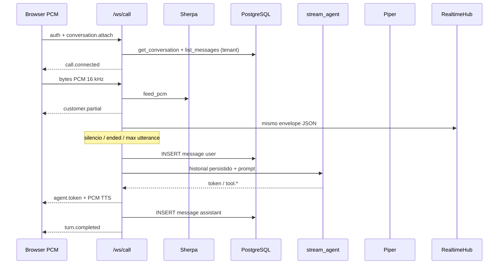

# Flujos de datos

**Estado:** verificado contra `backend/app/main.py` (`call_socket`, `_run_call_turn`, `_send_call_event`, `ask`).

## Turno de llamada (`/ws/call`)

Reglas de persistencia (*verificado*):

- Solo el transcript **final** usable y la respuesta **completa** del asistente.
- Parciales, tokens SSE y PCM **no** se guardan.
- Si falla el INSERT de usuario, el turno no llama al agente; si falla el de asistente, se emite `error`.

Umbrales de VAD/barge-in en `main.py` (*verificado*):

| Constante | Valor | Efecto |
| --- | --- | --- |
| `CALL_SPEECH_LEVEL` | 0.12 | Cuenta como habla |
| `CALL_BARGE_LEVEL` | 0.45 | Acumula hits de barge-in |
| `CALL_BARGE_STRONG` | 0.6 | Barge-in inmediato |
| `CALL_SILENCE_SECONDS` | 0.8 | Cierra utterance |
| `CALL_MAX_UTTERANCE_SECONDS` | 8.0 | Cierra utterance larga |

El historial en memoria del socket se recorta a 40 mensajes (`del history[:-40]`).

## `/ask` (SSE)

1. Auth Bearer → tenant del usuario.
2. Si hay `conversation_id`: carga historial DB, persiste el prompt de usuario, stream del agente, persiste asistente antes de `done`.
3. Si no hay `conversation_id`: exige `messages` (compatibilidad); **no** persiste.
4. Error **antes** del primer evento SSE → JSON HTTP 4xx/5xx.
5. Error **después** del primer token → evento SSE `error` (el status HTTP ya es 200).

## Fan-out de monitoreo

`_send_call_event` envía JSON al socket de la llamada **y** publica un `RealtimeEvent` al hub. Un fallo del hub no corta la llamada (*verificado:* try/except en `_send_call_event`).

El hub solo hace `send_json`. PCM, `wave.level` y `tts.format` no se republican como media; algunos eventos JSON de la llamada sí se copian al envelope.
