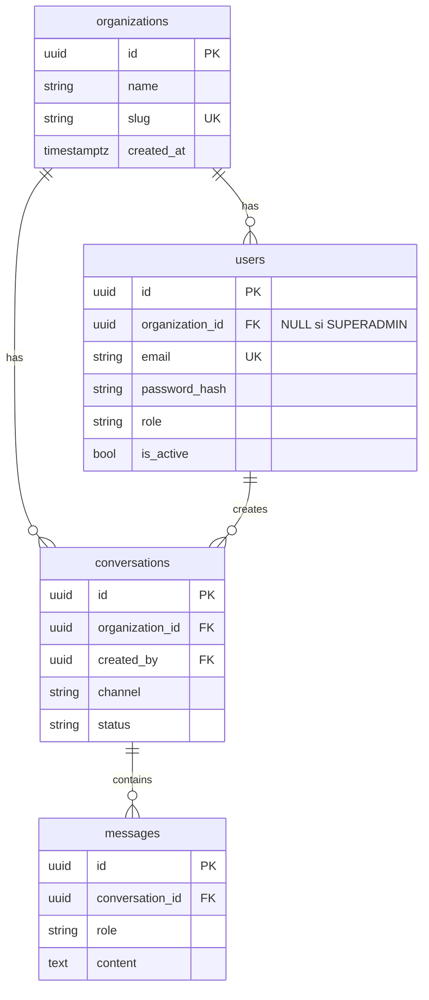

# Esquema

**Estado:** verificado contra `backend/app/db/models.py` y `backend/migrations/versions/0002_persistent_conversations.py`. Tests: `backend/tests/test_models.py`, `test_conversations.py`.

## Invariantes

- `users.role` ∈ `SUPERADMIN`, `ADMIN`.
- SUPERADMIN ⇒ `organization_id IS NULL`. ADMIN ⇒ `organization_id IS NOT NULL`.
- `messages.role` ∈ `user`, `assistant`, `system`, `tool`. El agente persiste solo `user` y `assistant` en el camino feliz.
- Borrar conversación hace CASCADE de mensajes. Borrar org/user está RESTRICT.

## Índices

- `ix_users_organization_id`
- `ix_conversations_organization_created_at` (`organization_id`, `created_at`)
- `ix_messages_conversation_created_at` (`conversation_id`, `created_at`)

## Queries de aplicación

`backend/app/db/queries.py` — siempre con `organization_id` del caller:

- `create_conversation` — el creator debe pertenecer a esa org (salvo SUPERADMIN, que igual no usa estas rutas HTTP).
- `get_conversation` — `id` AND `organization_id`.
- `list_messages` — join conversación + mismo filtro de tenant.

No hay listado global de conversaciones en HTTP.
